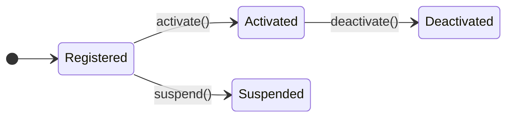

# Eloquent State Machine
This package provides a State Pattern system for Eloquent.

## Installation
```bash
composer require aryeo/eloquent-state-machines
```

## Overview
State Machine is a simple implementation of the State Pattern comprised of three parts:
- States: Discrete modes a `Model` can be in.
- Transitions: Available movement between states.
- Triggers: Work performed to complete a transition.

## Usage
### Define States
States are defined and configured through a Backed Enum.

```php
namespace Users\Status;

use Support\Database\Eloquent\StateMachines\Contracts\StateMachineable;
use Support\Database\Eloquent\StateMachines\Provides\ManagesState;

enum Status: string implements StateMachineable
{
    use ManagesState;

    case Registered = 'registered';
    case Activated = 'activated';
    case Suspended = 'suspended';
}
```

### Associate Events
> Note: If custom before/after events are not defined for each state a `\Support\Database\Eloquent\StateMachines\Attributes\Events\Exceptions\NotDefined` will be thrown.

#### 1. Create Events
```php
class Activating
{
    public readonly User $model;

    public function __construct(User $model)
    {
        $this->model = $model;
    }
}
```

```php
class Activated
{
    public readonly User $model;

    public function __construct(User $model)
    {
        $this->model = $model;
    }
}
```

#### 2. Register events
```php
namespace Users\Status;

use Support\Database\Eloquent\StateMachines\Attributes\Events\Events;
use Support\Database\Eloquent\StateMachines\Contracts\StateMachineable;
use Support\Database\Eloquent\StateMachines\Provides\ManagesState;

enum Status: string implements StateMachineable
{
    use ManagesState;
    // ...

    #[Events(before: Activating::class, after: Activated::class)]
    case Activated = 'activated';

    // ..
}
```

### Define Transitions
Transitions are represented by the target state and the trigger used to complete the operation.

#### 1. Create a Trigger
```php
namespace Users\Status\Triggers;

use Support\Database\Eloquent\StateMachines\Triggers\Target\Target;
use Support\Database\Eloquent\StateMachines\Triggers\Trigger;

class Suspend extends Trigger
{
    #[Target]
    protected readonly User $user;

    public function allowed(): bool
    {
        return $this->user->is_not_trashed;
    }

    public function handle(): void
    {
        // business operations...
    }
}
```

> Note: The `#[Target]` attribute is required to specify which property contains the model being operated on.

#### Register Transition
```php
namespace Users\Status;

use Support\Database\Eloquent\StateMachines\Attributes\Events\Events;
use Support\Database\Eloquent\StateMachines\Attributes\Transitions\Transition;
use Support\Database\Eloquent\StateMachines\Contracts\StateMachineable;
use Support\Database\Eloquent\StateMachines\Provides\ManagesState;
use Users\Status\Triggers;

enum Status: string implements StateMachineable
{
    use ManagesState;

    // ...

    #[Events(before: Activating::class, after: Activated::class)]
    #[Transition(to: self::Suspended, using: Triggers\Suspend::class)]
    case Activated = 'activated';

    // ..
    case Suspended = 'suspended';
}
```

### Configure Model
```php
namespace Users;

use Users\Status\Status;

class User extends Model
{
    protected $attributes = [
        'status' => Status::Registered,
    ];

    protected function casts(): array
    {
        return [
            'status' => Status::class,
        ];
    }
}
```

### Usage
Once your model is configured with a state machine enum, you can access the state machine through the casted property (e.g., `$user->status`). This gives you access to trigger methods that correspond to your defined transitions.

### Examples
```php
namespace Users\Actions;

class Suspend
{
    public function handle(User $user)
    {
        return $user->status->suspend()->run();
    }
}
```

```php
namespace Users\Policies;

class User
{
    // ...

    public function suspend(Authenticatable $authenticated, User $user)
    {
        if ($user->status->suspend()->blocked()) return false;

        // ...
    }
}
```

## Tooling
This package provides configuration for tooling that assist with development efforts and enforce the expectations / requirements when using this package.

## Diagramming
To keep your documentation updated a command is included to create Markdown Diagrams of the available State Machines:

<!-- diagram:Tests\Fixtures\Users\Status\Status:start -->
**`Tests\Fixtures\Users\Status\Status`**

<!-- diagram:Tests\Fixtures\Users\Status\Status:end -->

### Usage
The command offers two primary outcomes.

1. Outputs the markdown for all of your `StateMachineables` to the terminal.
`php artisan state-machine:diagram`

    ```
    <!-- [starting-identifier] -->
    {{ MERMAID_MARKDOWN }}
    <!-- [ending-identifier]  -->
    ```


2. Automatically scans all of your project's markdown files for existing diagrams and updates them with the latest representation of a `StateMachineable` flow.
`php artisan state-machine:diagram --update`

    > ℹ️
    The comments in the example output above are required for the automatic scanning process to locate diagrams in project markdown files.
