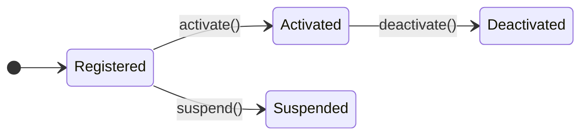

# Eloquent State Machine
This package provides a State Pattern system for Eloquent.

## Installation
```bash
composer require aryeo/eloquent-state-machines
```

## Overview
State Machine is a simple implementation of the State Pattern comprised of three parts:
- States: Discrete modes a `Model` can be in.
- Transitions: Available movement between states.
- Triggers: Work performed to complete a transition.

## Usage
### Define States
States are defined and configured through a Backed Enum.

```php
namespace Users\Status;

use Support\Database\Eloquent\StateMachines\Contracts\StateMachineable;
use Support\Database\Eloquent\StateMachines\Provides\ManagesState;

enum Status: string implements StateMachineable
{
    use ManagesState;

    case Registered = 'registered';
    case Activated = 'activated';
    case Suspended = 'suspended';
}
```

### Associate Events

#### 1. Create Events
```php
namespace Users\Status\Events;

use Users\User;

class Activating
{
    public readonly User $model;

    public function __construct(User $model)
    {
        $this->model = $model;
    }
}
```

```php
namespace Users\Status\Events;

use Users\User;

class Activated
{
    public readonly User $model;

    public function __construct(User $model)
    {
        $this->model = $model;
    }
}
```

#### 2. Register events

> Note: Every case must have an `#[Events]` attribute. If one is missing, a `\Support\Database\Eloquent\StateMachines\Attributes\Events\Exceptions\NotDefined` exception will be thrown.

```php
namespace Users\Status;

use Support\Database\Eloquent\StateMachines\Attributes\Events\Events;
use Support\Database\Eloquent\StateMachines\Contracts\StateMachineable;
use Support\Database\Eloquent\StateMachines\Provides\ManagesState;

enum Status: string implements StateMachineable
{
    use ManagesState;
    // ...

    #[Events(before: Activating::class, after: Activated::class)]
    case Activated = 'activated';

    // ..
}
```

### Define Transitions
Transitions are represented by the target state and the trigger used to complete the operation.

#### 1. Create a Trigger
```php
namespace Users\Status\Triggers;

use Support\Database\Eloquent\StateMachines\Triggers\Target\Target;
use Support\Database\Eloquent\StateMachines\Triggers\Trigger;
use Users\User;

class Suspend extends Trigger
{
    #[Target]
    protected readonly User $user;

    public function allowed(): bool
    {
        return $this->user->is_not_trashed;
    }

    public function handle(): void
    {
        // business operations...
    }
}
```

> Note: The `#[Target]` attribute is required to specify which property contains the model being operated on.

A `Trigger` is a specialized [Action](https://github.com/AryeoHQ/actions) — it extends the `Action` contract and uses `AsAction` under the hood, so it can be run synchronously with `->now()` or dispatched to the queue with `->dispatch()`. On top of that, a `Trigger` adds state management, event dispatching, transition logic, and gate checks via `allowed()` and `blocked()`.

> **Note:** `SerializesModels` is intentionally **not** included in `Trigger`. Like [Actions](https://github.com/AryeoHQ/actions), Eloquent models are serialized as-is — preserving the exact state at dispatch time rather than being re-fetched from the database when the job is processed. This ensures the worker operates on the data that was originally provided. If you prefer Laravel's default behavior of storing only the model identifier and rehydrating from the database at processing time, you can add `use \Illuminate\Queue\SerializesModels;` to your individual trigger classes.

> **Note:** Even though a `Trigger` is an Action, it defines a `final prepare()` method to register lifecycle middleware (transaction boundaries, `before()`/`after()` hooks) that the state machine depends on. Use the `$middleware` property to add your own middleware, and the constructor or `handle()` method parameters for setup and dependency injection.

#### 2. Register Transition
```php
namespace Users\Status;

use Support\Database\Eloquent\StateMachines\Attributes\Events\Events;
use Support\Database\Eloquent\StateMachines\Attributes\Transitions\Transition;
use Support\Database\Eloquent\StateMachines\Contracts\StateMachineable;
use Support\Database\Eloquent\StateMachines\Provides\ManagesState;
use Users\Status\Triggers;

enum Status: string implements StateMachineable
{
    use ManagesState;

    // ...

    #[Events(before: Activating::class, after: Activated::class)]
    #[Transition(to: self::Suspended, using: Triggers\Suspend::class)]
    case Activated = 'activated';

    // ..
    case Suspended = 'suspended';
}
```

#### Failures
When a particular `Trigger` fails the state machine will not be moved to the target state. However, you may want to alert your users or revert any actions that were partially completed by the trigger. To accomplish that, you may define a `failed` method on your `Trigger`. The `Throwable` instance that caused `handle()` to fail will be passed to `failed()`.

```php
namespace Users\Status\Triggers;

use Support\Database\Eloquent\StateMachines\Triggers\Target\Target;
use Support\Database\Eloquent\StateMachines\Triggers\Trigger;
use Throwable;
use Users\User;

class Upload extends Trigger
{
    #[Target]
    public readonly User $user;

    public function handle(): void
    {
        // business operations that may throw an exception...
    }

    public function failed(Throwable $throwable): void
    {
        $this->user->status->suspend()->now();
    }
}
```

### Testing

A `Trigger` is an [Action](https://github.com/AryeoHQ/actions) — test it the same way. Focus on your business logic: `handle()`, `allowed()`, and `failed()`. The lifecycle plumbing (events, transitions, queue middleware) is handled by the package.

#### Testing handle()

Call `->now()` to execute the trigger synchronously and assert the side effects of your business logic.

```php
$user = User::factory()->registered()->create();

$user->status->activate()->now();

$this->assertNotNull($user->activated_at);
```

#### Testing allowed()

```php
$trigger = $user->status->suspend();

$this->assertTrue($trigger->allowed());
$this->assertFalse($trigger->blocked());
```

#### Testing failed()

If your trigger defines a `failed()` method, test it by triggering a failure through `->now()`:

```php
$user = User::factory()->registered()->create();

rescue(fn () => $user->status->upload()->now());

$this->assertEquals(Status::Suspended, $user->refresh()->status->enum);
```

#### Asserting a trigger was dispatched

When testing code that _dispatches_ a trigger (e.g., a controller or listener), use `::fake()` and `::assertFired()`:

```php
Activate::fake();

// ... code under test that dispatches Activate ...

Activate::assertFired();
```

> **Note:** `dispatch()` puts the trigger on the queue. You do not need to test `dispatch()` directly — the package tests the queue integration. Use `->now()` to test your trigger's behavior.

### Configure Model
```php
namespace Users;

use Users\Status\Status;

class User extends Model
{
    protected $attributes = [
        'status' => Status::Registered,
    ];

    protected function casts(): array
    {
        return [
            'status' => Status::class,
        ];
    }
}
```

### Usage
Once your model is configured with a state machine enum, you can access the state machine through the casted property (e.g., `$user->status`). This gives you access to trigger methods that correspond to your defined transitions.

### Examples
```php
namespace Users\Actions;

use Users\User;

class Suspend
{
    public function handle(User $user)
    {
        return $user->status->suspend()->now();
    }
}
```

```php
namespace Users\Policies;

use Illuminate\Auth\Authenticatable;
use Users\User;

class User
{
    // ...

    public function suspend(Authenticatable $authenticated, User $user)
    {
        if ($user->status->suspend()->blocked()) return false;

        // ...
    }
}
```

## Tooling
This package provides configuration for tooling that assist with development efforts and enforce the expectations / requirements when using this package.

## Generator
Scaffold a new state machine enum with:

```bash
php artisan make:state-machine Status --model=App\\Models\\User
```

This creates a backed enum implementing `StateMachineable` with the `ManagesState` trait, along with a co-located test file. If `--model` is omitted, you will be prompted to select one.

## Diagramming
To keep your documentation updated a command is included to create Markdown Diagrams of the available State Machines:

<!-- diagram:Tests\Fixtures\Support\Users\Status\Status:start -->
**`Tests\Fixtures\Support\Users\Status\Status`**

<!-- diagram:Tests\Fixtures\Support\Users\Status\Status:end -->

### Usage
The command offers two primary outcomes.

1. Outputs the markdown for all of your `StateMachineables` to the terminal.
`php artisan state-machine:diagram`

    ```
    <!-- [starting-identifier] -->
    {{ MERMAID_MARKDOWN }}
    <!-- [ending-identifier]  -->
    ```


2. Automatically scans all of your project's markdown files for existing diagrams and updates them with the latest representation of a `StateMachineable` flow.
`php artisan state-machine:diagram --update`

    > ℹ️
    The comments in the example output above are required for the automatic scanning process to locate diagrams in project markdown files.
